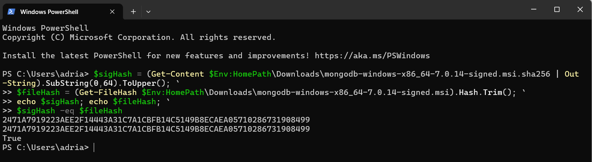
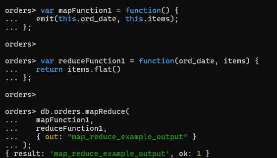

Experiment 5

Issues: 
The only issue I encountered during this assignment was getting the MongoDB version right. As the assignment told me to
download version 4.4, however I couldn't find it anywhere. Therefore I ended up just downloading version 7.0.14, and 
everything else worked fine.
Confirmation of download:

Exp1
Inserting:
- 
- 
Querying:
-  
- 
Updating:
- 
Deleting:
- 
BulkWrite:
- 

Exp2
My Map-Reduce function helps to find which day different items where bought, which gives information that for example
will help stores to know which day they should put out extra amounts of a certain product in order to meet the demands 
better. For example, we can see from the result that pears are very very rarely sold, and therefore it should not be
a priority to sell compared to for example oranges.
The function maps the items to the ord_date, and then reduces all the same-date purchases together, giving this result:
- 
- 
- 

No pending issues with this assignment.