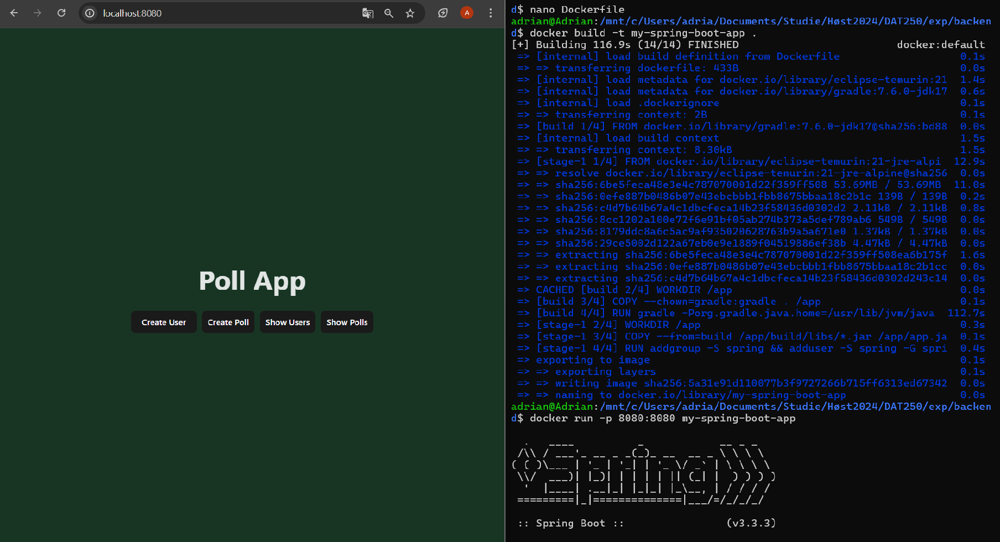

For the experiment this week I had lots of troubles with the first part, and almost no issues with the second
part of the assignment.

For the first part of the assignment I did not succeed in getting everything to work. I managed to set up Docker and 
PostgreSQL without issues, I also replaced all the H2 parameters with Postgres in the persistence file, and I added the 
new dependency. However, I could not manage to pass the JUnit tests, even though I (think I) successfully created
the Postgres database tables. I could manage to print out the tables, but all the tests would fail all the time sadly.

When it comes to the second part of the assignment, almost everything worked straight away as I was working with it! The
only issue I really encountered was gradle version in the Dockerfile. I was really confused as I was certain that I 
needed to use version 21 of Gradle for some reason, but there is no official docker image of gradle version 21, this 
took me a little while to understand, but in the end I got it do work. All in all I successfully managed to run the
docker on port 8080 and got to see my spring boot application in action:

When it comes to pending issues with this assignment, it is only to get the JUnit tests for the first part to pass. 
Other than that, everything works fine.